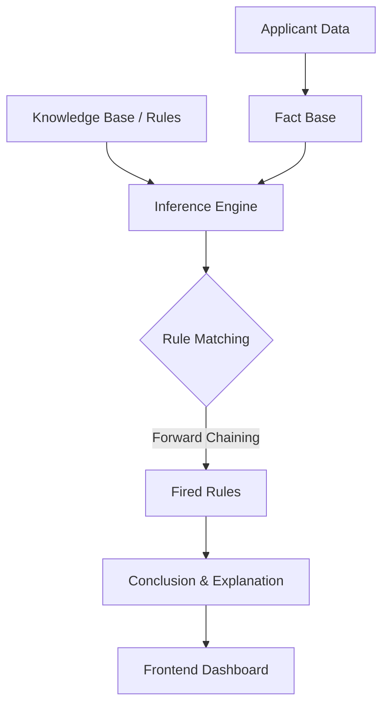

<p align="center">
  
</p>

<h1 align="center">LoanIQ Expert System</h1>

<p align="center">
  <strong>A high-fidelity, rule-based expert system for automated loan approval analysis.</strong>
</p>

<p align="center">
  
  
  
  
</p>

---

LoanIQ is a modern fintech application that leverages a sophisticated **Forward-Chaining Inference Engine** to automate the complex process of loan risk assessment. Built with a "premium-first" design philosophy, it provides both financial institutions and applicants with clear, rule-based explanations for every decision.

## ✨ Key Features

- 🧠 **Expert System Core**: Custom forward-chaining inference engine with priority-based rule firing and conflict resolution.
- ⚡ **Real-time Analytics**: Dynamic credit score gauges and debt-to-income (DTI) visualizers.
- 🎨 **Premium UX**: Glassmorphism UI components, fluid Framer Motion animations, and responsive dark-mode aesthetics.
- 📊 **Explainable AI**: Every decision comes with an "Explanation Chain" showing exactly which financial rules were triggered.
- 🛡️ **Risk Profiles**: Categorizes applicants into Approved, Rejected, or Manual Review based on 10+ granular financial metrics.

## 🛠️ Technology Stack

| Layer | Technologies |
| :--- | :--- |
| **Frontend** | React 18, TypeScript, Vite, Framer Motion, Tailwind CSS, Lucide Icons |
| **Backend** | FastAPI, SQLAlchemy, Pydantic, Python 3.10+ |
| **Database** | SQLite (Production-ready schema with relationship mapping) |
| **Logic** | Custom Rules Engine with Fact-based Inference |

## 📐 Architecture Overview

The system follows a classic Expert System architecture, separating the knowledge base from the inference logic.



## 🚀 Getting Started

### 📋 Prerequisites

- **Python**: 3.9 or higher
- **Node.js**: 18.x or higher
- **Package Manager**: `pnpm` (recommended) or `npm`

### 🔧 Installation

1. **Clone the repository**
   ```bash
   git clone https://github.com/your-repo/loan-approval-system.git
   cd loan-approval-system
   ```

2. **Setup Backend**
   ```bash
   cd backend
   python -m venv .venv
   source .venv/bin/activate  # On Windows use: .venv\Scripts\activate
   pip install -r requirements.txt
   ```

3. **Setup Frontend**
   ```bash
   cd ../frontend
   pnpm install  # or npm install
   ```

### 🏃 Running the Application

> [!TIP]
> Run the backend first to ensure the API is available for the frontend to fetch system rules and stats.

- **Start Backend**: 
  ```bash
  cd backend
  uvicorn app:app --reload
  ```
- **Start Frontend**: 
  ```bash
  cd frontend
  pnpm dev
  ```

## 📂 Project Structure

```text
├── backend/
│   ├── routes/            # API Endpoints
│   ├── inference_engine.py # Core reasoning logic
│   ├── rules_engine.py     # Rule definitions & structures
│   ├── knowledge_base.py   # Initial facts and rulesets
│   └── models.py           # Database schemas
├── frontend/
│   ├── src/
│   │   ├── components/    # Reusable UI elements
│   │   ├── pages/         # Dashboard and Application forms
│   │   └── animations/    # Framer Motion variants
└── docs/
    └── assets/            # Brand assets & logos
```

## ⚖️ System Rules

The inference engine evaluates applications against several key domains:
1. **Credit Worthiness**: High-threshold checks for prime loan rates.
2. **Financial Ratios**: Strict DTI (Debt-to-Income) validation (< 40%).
3. **Collateral Quality**: Evaluation of asset-backed security for secured loans.
4. **Employment Stability**: Minimum 2-year tenure requirements.
5. **Purpose Analysis**: Risk weighting based on loan intent (e.g., Business vs. Personal).

---

<p align="center">
  Built with ❤️ for Modern Fintech.
</p>
